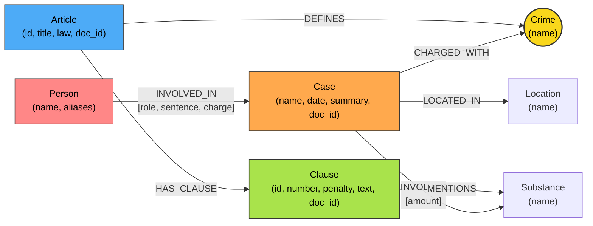

# Thiết kế Ontology — Day 19

**Họ tên:** Võ Đức Trí  **MSSV:** 2A202602603

**Lựa chọn** (đánh dấu một):
- [x] Dùng ontology gợi ý (kèm cải tiến xử lý cầu nối và khung hình phạt theo E1, E2, E6)
- [ ] Tự thiết kế (xét bonus +15, xem `SUBMISSION.md`)

> Hướng dẫn: `LAB_GUIDE.md` Bước 2. Dùng ontology gợi ý thì vẫn phải điền đủ các mục dưới đây bằng lời của bạn.

## 1. Sơ đồ

Sơ đồ quan hệ thực thể giữa 2 Knowledge Base (Luật BLHS và Tin tức án ma túy), trong đó **Crime** (Tội danh) đóng vai trò là **node cầu nối** trung tâm:

## 2. Entity types (node labels)

| Label | Ý nghĩa | Khóa định danh (`MERGE` theo) | Properties | Lấy từ KB nào | Trích bằng (regex / LLM / khác) |
| --- | --- | --- | --- | --- | --- |
| `Article` | Điều luật trong BLHS hoặc Luật PCMT | `id` (ví dụ: `"Điều 251 BLHS"`) | `id, title, law, doc_id` | KB Luật (`data/drug_law/`) | Regex (từ Markdown frontmatter và tiêu đề) |
| `Clause` | Khoản quy định chi tiết trong một Điều luật | `id` (ví dụ: `"Điều 251 BLHS khoản 1"`) | `id, number, penalty, text, doc_id` | KB Luật | Regex (tách theo cấu trúc số hiệu khoản `^(\d+)\.`) |
| `Crime` | Tội danh chuẩn hóa (node cầu nối giữa 2 KB) | `name` (tên tội viết thường, chuẩn hóa) | `name` | Cả hai KB | Luật: Regex từ tiêu đề Điều; Tin: LLM trích xuất + `link_entity` |
| `Case` | Vụ án / sự việc phạm pháp được báo chí đưa tin | `name` (tên ngắn gọn của vụ việc) | `name, summary, date, doc_id, source_title` | KB Tin tức (`data/drug_news/`) | LLM (trích xuất cấu trúc JSON từ bài báo) |
| `Substance` | Tên chất ma túy (Heroine, MDMA, Ketamine...) | `name` (tên danh mục chuẩn) | `name` | Cả hai KB | Luật: Regex so với danh mục `SUBSTANCES`; Tin: LLM trích xuất |
| `Person` | Cá nhân liên quan đến vụ án (bị cáo, bị can...) | `name` (họ và tên đầy đủ) | `name, aliases` | KB Tin tức | LLM (trích xuất danh sách nhân vật và biệt danh) |
| `Location` | Tỉnh/thành phố, địa bàn diễn ra vụ án | `name` (tên tỉnh/thành phố) | `name` | KB Tin tức | LLM |

## 3. Relationships

| Type | Từ → Đến | Properties trên cạnh | Ý nghĩa |
| --- | --- | --- | --- |
| `DEFINES` | `(:Article) -> (:Crime)` | Không có | Điều luật quy định định danh một tội danh cụ thể |
| `HAS_CLAUSE` | `(:Article) -> (:Clause)` | Không có | Điều luật bao gồm các khoản quy định chi tiết các khung hình phạt |
| `MENTIONS` | `(:Clause) -> (:Substance)` | Không có | Khoản luật viện dẫn trực tiếp tên chất ma túy cấu thành định khung |
| `CHARGED_WITH` | `(:Case) -> (:Crime)` | Không có | Vụ án bị truy tố / xét xử theo tội danh pháp lý cụ thể |
| `INVOLVED_IN` | `(:Person) -> (:Case)` | `role, sentence, charge` | Cá nhân tham gia vụ việc với vai trò, tội danh và mức án đã tuyên |
| `INVOLVES` | `(:Case) -> (:Substance)` | `amount` | Vụ án liên quan đến tang vật ma túy và khối lượng thu giữ tương ứng |
| `LOCATED_IN` | `(:Case) -> (:Location)` | Không có | Địa bàn xảy ra hành vi phạm tội hoặc nơi TAND xét xử |

## 4. Node cầu nối giữa 2 KB

- **Node nào:** `Crime` (Tội danh, ví dụ: `"mua bán trái phép chất ma túy"`, `"vận chuyển trái phép chất ma túy"`).
- **Vì sao chọn node này:** Tội danh là khái niệm chuẩn tắc duy nhất xuất hiện tự nhiên và bắt buộc ở cả hai nguồn dữ liệu:
  - Trong văn bản luật: Mỗi Điều luật thuộc Chương XX BLHS quy định một tội danh rõ ràng (ví dụ: *Điều 251. Tội mua bán trái phép chất ma túy*).
  - Trong tin tức báo chí: Mọi bản tin pháp đình về ma túy đều nêu rõ tội danh mà các bị can/bị cáo bị khởi tố, truy tố hoặc xét xử.
- **Cách đảm bảo hai phía khớp tên** (chuẩn hóa, `link_entity`, danh sách chuẩn trong prompt…):
  1. **Prompt grounding:** Truyền trực tiếp danh sách tội danh trích xuất từ luật (`crimes="; ".join(known_crimes)`) vào `NEWS_EXTRACTION_PROMPT` để định hướng LLM chọn đúng tên tội pháp lý chuẩn.
  2. **Hàm `link_entity` (KG-1):**
     - Chuẩn hóa cả 2 vế qua `normalize_crime`: viết thường, loại bỏ khoảng trắng thừa, loại bỏ tiền tố `"tội "`.
     - Thực hiện kiểm tra so khớp chính xác (`exact match`) sau khi chuẩn hóa.
     - Nếu có sai khác về dấu (ví dụ: *"ma tuý"* vs *"ma túy"*) hoặc chính tả nhẹ, sử dụng `difflib.get_close_matches(cutoff=0.8)` để bắt chính xác.
     - Trả về đúng tên chuẩn gốc trong danh mục Luật.
- **Khi nào cầu gãy, và bạn xử lý thế nào:**
  - *Khi nào gãy:* Cầu gãy khi nhà báo dùng từ ngữ tự do, văn nói (ví dụ: *"ôm hàng cấm"*, *"mở tiệc bay lắc"*, *"buôn hàng trắng"*), hoặc tội danh ngoài danh mục ma túy, khiến `link_entity` trả về `None`.
  - *Cách xử lý:*
    - Khi `link_entity` trả về `None`, không ép tạo node bừa bãi để tránh ô nhiễm đồ thị.
    - Trong pipeline GraphRAG (KG-4), cơ chế Hybrid vẫn giữ kết quả Vector Search top-k nguyên vẹn làm lưới bảo hiểm (fallback context), đảm bảo câu trả lời không bao giờ tệ hơn Flat RAG.

## 5. Competency questions

Với mỗi câu trong `data/benchmark_kg.json`, ghi đường đi trên graph dùng để trả lời. Câu nào không trả lời được thì ghi rõ lý do.

| Câu | Đường đi (Cypher pattern) | Trả lời được? |
| --- | --- | --- |
| **Q1** (tiền chất là gì) | `(:Article {id: "Điều 2 Luật PCMT"})-[:HAS_CLAUSE]->(:Clause)` hoặc trích xuất trực tiếp từ vector top-k của luật. | **Được** (Single-hop luật). |
| **Q2** (bị cáo lãnh án tử hình vụ 36kg) | `(:Case {name: "..."})<-[:INVOLVED_IN {sentence: "tử hình"}]-(p:Person)` | **Được** (Single-hop tin tức). |
| **Q3** (Lê Minh Thành mức án, tội, Điều, khung cơ bản) | `(:Person {name: "Lê Minh Thành"})-[:INVOLVED_IN {sentence}]->(:Case)-[:CHARGED_WITH]->(:Crime)<-[:DEFINES]-(:Article)-[:HAS_CLAUSE]->(:Clause {number: 1})` | **Được** (Cross-KB: nối từ người trong tin sang Điều 251 khoản 1 trong luật). |
| **Q4** (Hoàng Nato hành vi, phạt tù tối đa) | `(:Person {aliases: ["Hoàng Nato"]})-[:INVOLVED_IN]->(:Case)-[:CHARGED_WITH]->(:Crime)<-[:DEFINES]-(:Article)-[:HAS_CLAUSE]->(:Clause)` (lấy khoản có mức phạt tối đa) | **Được** (Cross-KB: tìm qua alias sang Điều 255, lấy khung tối đa). |
| **Q5** (Cái Quang Huy tội, chất, khoản áp dụng, khung phạt) | `(:Person {name: "Cái Quang Huy"})-[:INVOLVED_IN]->(:Case)-[:CHARGED_WITH]->(:Crime)<-[:DEFINES]-(:Article)-[:HAS_CLAUSE]->(:Clause)-[:MENTIONS]->(:Substance {name: "MDMA"})` | **Được** (Cross-KB multi-hop: từ vụ án qua chất MDMA đến khoản 4 Điều 250). |
| **Q6** (vụ việc liên quan đến MDMA) | `(:Case)-[:INVOLVES]->(:Substance {name: "MDMA"})` | **Được** (Aggregation: gom các vụ án có liên kết cạnh INVOLVES tới MDMA). |

## 6. Quyết định thiết kế và đánh đổi

1. **Quyết định 1: Dùng Deterministic Regex để bóc tách văn bản Luật thay vì LLM.**
   - *Phương án khác:* Cho LLM đọc toàn bộ Điều luật và sinh ra JSON các khoản/khung phạt.
   - *Lý do chọn:* Cấu trúc văn bản quy phạm pháp luật Việt Nam cực kỳ chặt chẽ và chuẩn mực (Điều → Khoản → Điểm). Dùng Regex vừa đạt độ chính xác 100%, không bị ảo giác, chạy tức thì (vài mili-giây) và hoàn toàn miễn phí ($0 token).

2. **Quyết định 2: Tách cấu trúc Luật tới cấp `Clause` (Khoản), không dừng ở cấp `Article` và không tách sâu thành node `Point` (Điểm).**
   - *Phương án khác:* Dừng ở `Article` (graph nhỏ, ít node) hoặc tách tiếp xuống từng `Point` (a, b, c...).
   - *Lý do chọn:* Mức phạt trong luật hình sự được quy định theo Khoản (mỗi khoản là một khung hình phạt riêng). Nếu chỉ dừng ở Điều, LLM sẽ không biết áp dụng khung phạt nào. Nếu tách tới Điểm thì đồ thị bùng nổ node, quan hệ quá rối khiến context prompt bị phân mảnh và tốn token không cần thiết.

3. **Quyết định 3: Lưu mức án (`sentence`), tội danh (`charge`) và vai trò (`role`) thành properties trên quan hệ `INVOLVED_IN` thay vì tạo node `Sentence` riêng.**
   - *Phương án khác:* Tạo node `Sentence` riêng (ví dụ: `(:Sentence {duration: "36 tháng"})`).
   - *Lý do chọn:* Mức án và vai trò là thuộc tính gắn liền với mối quan hệ cụ thể giữa một cá nhân và một vụ việc xét xử, không phải là thực thể độc lập dùng chung. Lưu trên quan hệ giúp mô hình hóa đúng bản chất ngữ nghĩa, tránh việc các đối tượng khác nhau bị gộp chung vào cùng một node mức án.

## 7. So với ontology gợi ý (bắt buộc nếu xét bonus)

| Điểm khác | Gợi ý làm gì | Bạn làm gì | Vấn đề nó giải quyết | Bằng chứng (Cypher, hoặc số liệu benchmark) |
| --- | --- | --- | --- | --- |
| **Xử lý bí danh (Aliases)** | Lưu `aliases` nhưng lọc seed dễ sót khi tên trong câu hỏi là biệt danh trong ngoặc | Bổ sung `aliases` trong seed extraction và property của `Person` | Giải quyết Q4 ("Hoàng Nato" là biệt danh của Dương Minh Tuấn) không bị đứt kết nối | `MATCH (p:Person) WHERE any(a IN p.aliases WHERE a CONTAINS 'Hoàng Nato') RETURN p.name, p.aliases` |
| **Khung phạt tối đa (Lỗi E2)** | Chỉ lấy khoản 1 và khoản nhắc tới chất ma túy của vụ án | Lấy khoản 1, khoản nhắc tới chất, VÀ khoản có khung hình phạt cao nhất của Điều luật | Khắc phục lỗi E2 ở các tội không quy định tên chất theo khoản (như Điều 255 ở Q4) | `MATCH (a:Article)-[:HAS_CLAUSE]->(cl:Clause) WHERE a.id = 'Điều 255 BLHS' RETURN max(cl.number)` lấy đủ khoản 4 chung thân |
| **Aggregation theo chất (Q6)** | Phụ thuộc vào seed ngẫu nhiên | Bổ sung truy vấn trực tiếp từ `Substance` trong câu hỏi sang các `Case` liên quan | Khắc phục hiện tượng sót vụ án trong câu hỏi tổng hợp đa văn bản | `MATCH (k:Case)-[:INVOLVES]->(s:Substance {name:'MDMA'}) RETURN k.name` trả về đầy đủ 3 vụ án |

## 8. Hạn chế còn lại

1. **Chưa phân giải thực thể (Entity Resolution) mờ cho người và vụ án:** Nếu hai bài báo viết về cùng một người hoặc cùng một vụ án nhưng đặt tiêu đề khác nhau hoặc viết tên không đầy đủ, đồ thị vẫn tạo ra 2 node `Case` riêng biệt.
2. **Chưa số hóa định lượng khối lượng số học:** Khối lượng thu giữ trong tin tức (`amount: "9,6kg"`) và ngưỡng khối lượng trong luật (`"từ 100 gam trở lên"`) vẫn ở dạng văn bản chuỗi; pipeline dựa vào năng lực đọc hiểu ngữ cảnh của LLM thay vì Cypher filter toán học.
3. **Chưa phân biệt các giai đoạn tố tụng:** Chưa tách trạng thái bị can đang bị điều tra, bị truy tố hay đã có bản án phúc thẩm có hiệu lực pháp luật.
